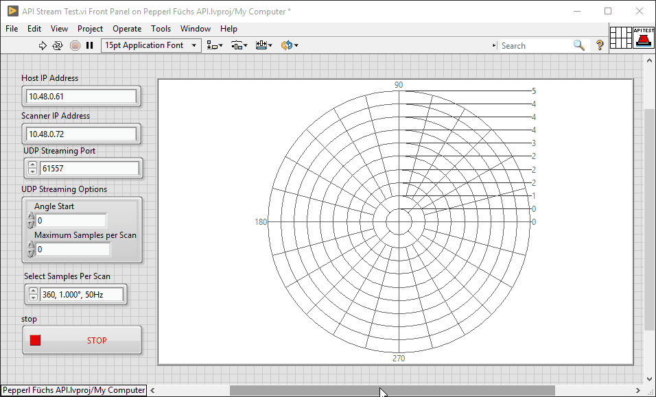
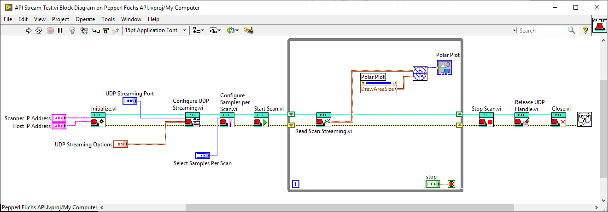

# Pepperl-Fuchs-Scanner-API

This API can be used to make LabVIEW communicate with the [R2000 laser scanner](https://www.pepperl-fuchs.com/brazil/pt/22905.htm) by Pepperl+Füchs

## This is the API Project in LabVIEW

The project will contain the classe of the API, which defines the attributes (data) and methods (actions/functions) that you can perform with LabVIEW. Also, there is a set of TestVIs included that validates specific parts of the API.

What the API does is wrap up the HTTP/UDP communication protocol and the interpretation of the data received in a more user friendly format.

>This API will work fine with versions 1.2 to 1.4 (versions tested).

## API Data Stream Example

The following example is included and is a great way to check the general functionality of the API.

### Front Panel

### Block Diagram

## Future improvements

I do not intend to be back to this project since I do not have the scanner with me anymore, but feel free to make a pull request whenever you want.
